网页版说明书：[https://zmk-info.pages.dev/](https://zmk-info.pages.dev/)

## 基础配置说明

1.  有线+蓝牙(5.0+)双模
2.  改键[https://zmk.yalishibukede.dpdns.org/](https://zmk.yalishibukede.dpdns.org/)，需连接数据线（安卓Type-C数据线）
3.  开关(c口为上)：拨上为**开**，拨下为**关**
4.  自动休眠：15分钟无操作进入深度休眠，任意按键可唤醒，唤醒3-4秒完成重连
5.  功耗续航计算：[https://zmk.dev/power-profiler](https://zmk.dev/power-profiler)
6.  键值测试：[https://app.adamhxx.top/test](https://app.adamhxx.top/test) （仅支持常规键值检测）

## 设备状态说明

\_**新设备配对若提示 无法配对或密钥不正确 \_\_，按一下底部异色按钮（重置蓝牙）后再尝试配对**\_

| 是否

| 连接数据线 | 灯状态 | 设备状态 |
| --- | --- | --- |
| 是 | **蓝灯常亮** | 充电中🔋 |
| **蓝**灯**闪\*\*\*\*烁** | 开关未开，未充电，但可有线使用 |   |
| **无灯亮** | **已满电**💯 |   |
| **红灯\*\*\*\*为呼吸灯状态** | Boot模式，可刷入固件 |   |

其它：未连接数据线且关机状态，向上拨动开关(打开电源)，**红**灯**闪\_烁两下后灭掉即为\_开机成功**。

## 设备名称

|   | 有线设备名 | 蓝牙设备名 | 电池大小 |
| --- | --- | --- | --- |
| 带旋钮翻页器 | RCPen (RCPenK或RCPenL) | RCPen-BT(或RCPenL-BT) | v1：200mAh，v2：70/90 mAh |
| 3键翻页器 | 3kbd | 3kbd-BT | 70/90 mAh |
| 2键翻页器 | 2kbd | 2kbd-BT | 40 mAh |
| 5键+1旋钮 | Bento | Bento-BT | 200mAh / 400mAh |

## 改键说明

请使用谷歌内核浏览器：谷歌浏览器  或 Edge 

最低版本要求 Chrome 89, Edge 89

~改键地址：~[~https://zmk.studio/~](https://zmk.studio/)~~ (**不建议)，推荐**👉 \*\*[**https://zmk.adamhxx.top/**](https://zmk.adamhxx.top/)

**备用地址：**[**https://zmk-studio.pages.dev/**](https://zmk-studio.pages.dev/)

[**https://zmk.yalishibukede.dpdns.org/**](https://zmk.yalishibukede.dpdns.org/)

**其他社区改键网站：**[**https://zmk-studio-6y4.pages.dev/**](https://zmk-studio-6y4.pages.dev/)

### 第一步：连接数据线，选择设备

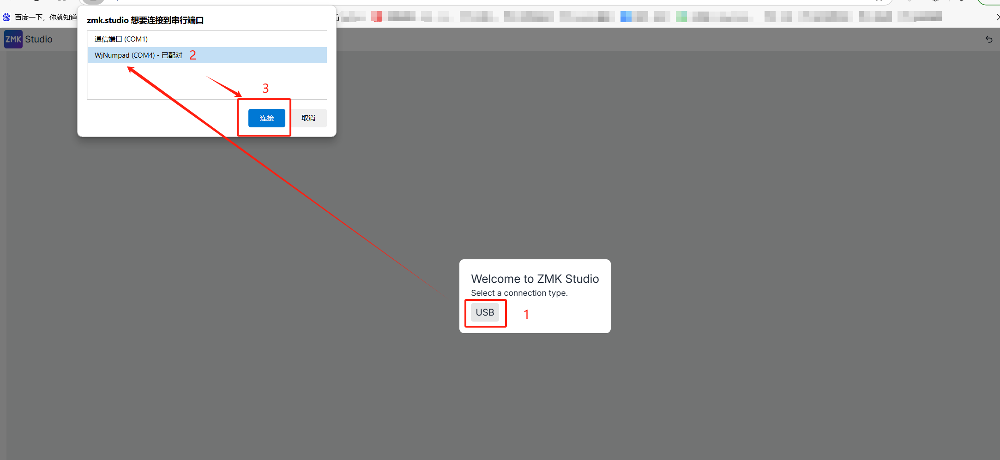

### 第二步：进入改键界面(了解功能区域)

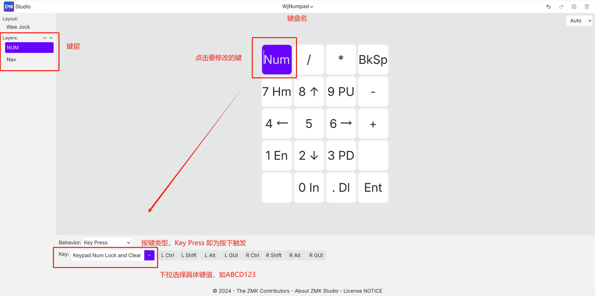 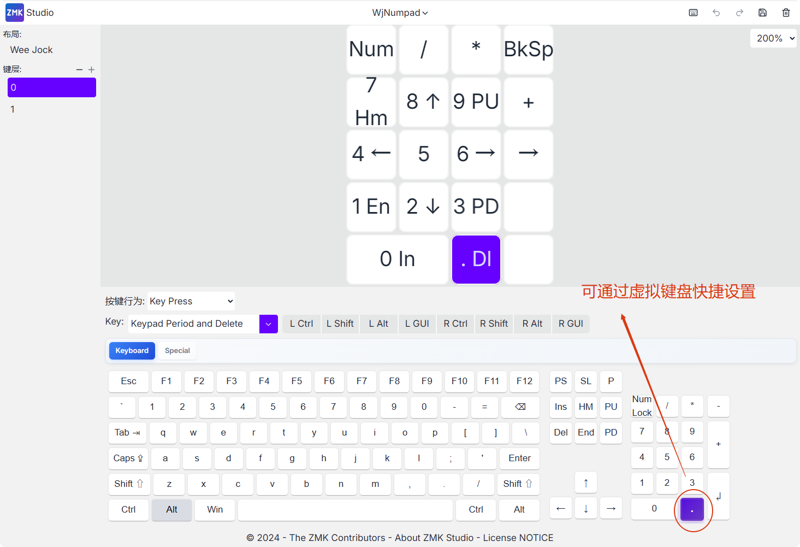

### 第三步：保存修改

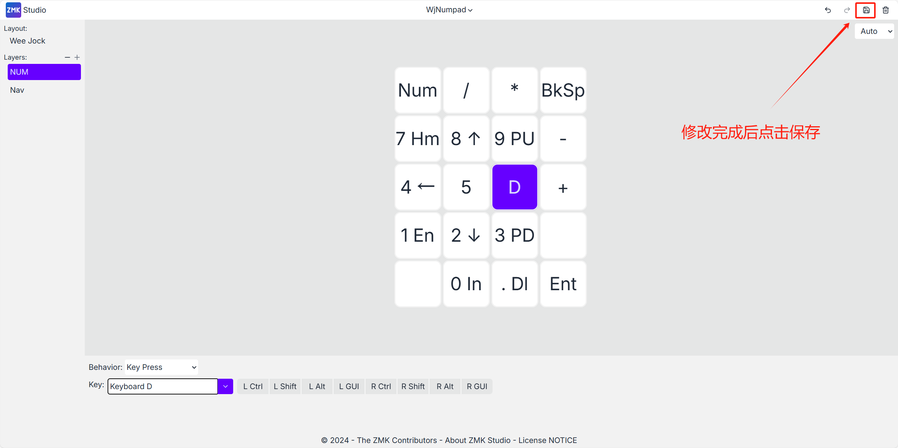

### ✅常用键值(Key Press类型)

| 功能 | 键值 |   |
| --- | --- | --- |
| ⬆ | Keyboard UpArrow |   |
| ⬇ | Keyboard DownArrow |   |
| ⬅️ | Keyboard LeftArrow |   |
| ➡️ | Keyboard RightArrow |   |
| 音量+ （适用PC） | Volume Increment |   |
| 音量- （适用PC） | Volume Decrement |   |
| 音量+ （适用安卓📱） | Keyboard Volume Up |   |
| 音量- （适用安卓📱） | Keyboard Volume Down |   |
| **锁屏 （仅测试安卓**📱**）** | AL Terminal Lock/Screensaver | \*\*文石 \*\*建议使用自带快捷键 |
| cmd + L |  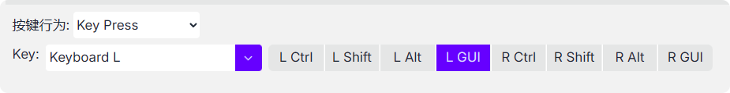 |   |
| **截屏 （仅测试安卓**📱**）** | Snapshot |   |
| **Home键 (仅测试安卓)** | AC Home |   |
| **熄屏(已测试小米14、vivo x80)** | 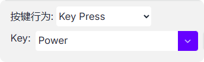 |   |
| **返回键(已测试小米14)** | 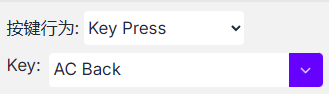 |   |

## 特殊键值

### 1️⃣Mod-Tap 根据按键是按住还是点击，发送不同的按键

先设置的时**按住时**触发的键值，实际使用中按太久会一直触发哦

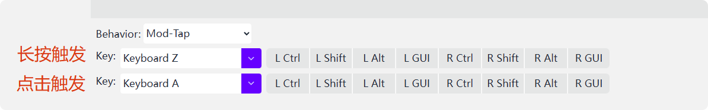

### 2️⃣Layer-Tap

可分别设置

1.  按住时临时激活的键层
2.  短按触发的按键键值

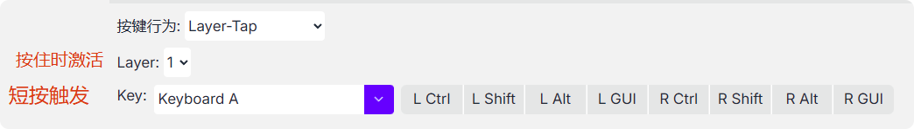

### 3️⃣进入Boot模式(用于更新固件)

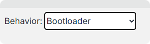

tips: 保存改键配置后按**此按键**后电脑会出现一个**新的磁盘**，磁盘名为 **NICENANO**

将对应的新固件(**uf2格式文件**)拖入此磁盘即可完成固件更新，磁盘会自动消失，键盘固件生效

### 4️⃣切层键

请勿在改键界面以拖动的方式调换层，**不会生效！！！且容易混淆！！！**

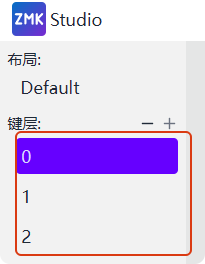

#### 一、按下时切至指定层 Monmentary Layer

Momentary Layer: 按下时切至配置层，释放后回到原来的键层

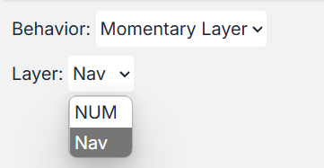

#### 二、按过后切至指定层(可以通过单个键不断切换键层) To Layer

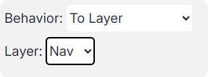

### 5️⃣组合键

可实现：一键复制、一键粘贴、一键锁屏等操作

GUI 在windows上即为win键，在Mac上为Command，在文石上为Cmd

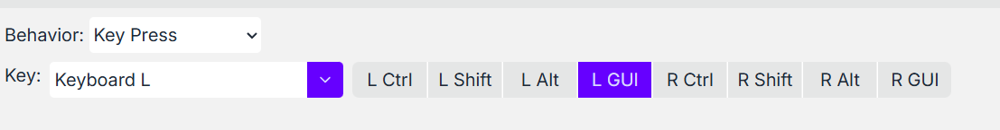

win + L 即为锁屏

Ctrl + C 复制

Ctrl + V 粘贴

### 6️⃣蓝牙操作 

#### 一、切换至指定蓝牙配置

切换至【配置0】

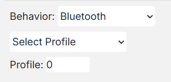

#### 二、断开指定蓝牙配置

断开【配置0】

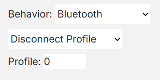

#### 三、切至上一份配置

可从【配置n】切至【配置n-1】

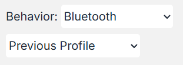

#### 四、切至下一份配置

可从【配置n】切至【配置n+1】

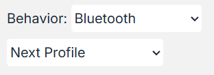

#### 五、删除当前蓝牙配置

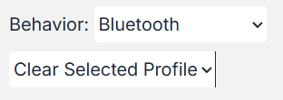

#### 六、删除所有蓝牙配置

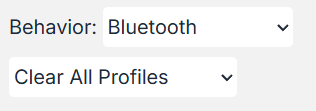

### 7️⃣RGB灯相关操作 Behavior选择 Underglow

#### 按一下开或关 灯效

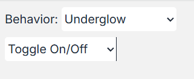

其他操作说明

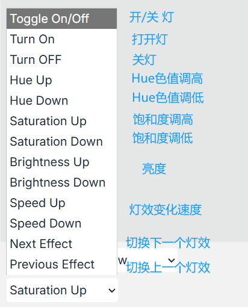

### 8️⃣鼠标按键 Behavior选择 Mouse Key Press

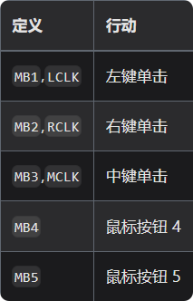

### 抖音参考配置

#### 1.安卓平板

| ⬇ | Keyboard DownArrow | 下一视频（pad） |
| --- | --- | --- |
| ⬆ | Keyboard UpArrow | 上一视频（pad） |
| Z | Keyboard Z | 点赞 |

#### 2.苹果手机

1.  需改键将按键修改为Mouse Key Press类型(鼠标按键)
    1.  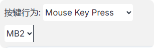
2.  通过辅助功能实现按键触发自定义手势（具体配置方法请网络搜索教程）

### 双设备切换配置参考

:::info  
实现效果：在两个设备之间切换

切换操作：按住旋钮按键，同时按一下键帽按键，可以切到蓝牙配置0或1(取决于按键配置的是配置几)

:::

#### 第一步：指定一个键用于切瞬时层（按下时激活对应层）

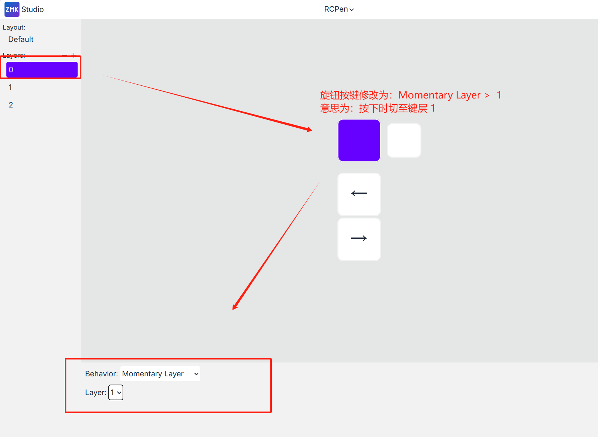

#### 第二步：设置对应层的键值用于切换蓝牙配置

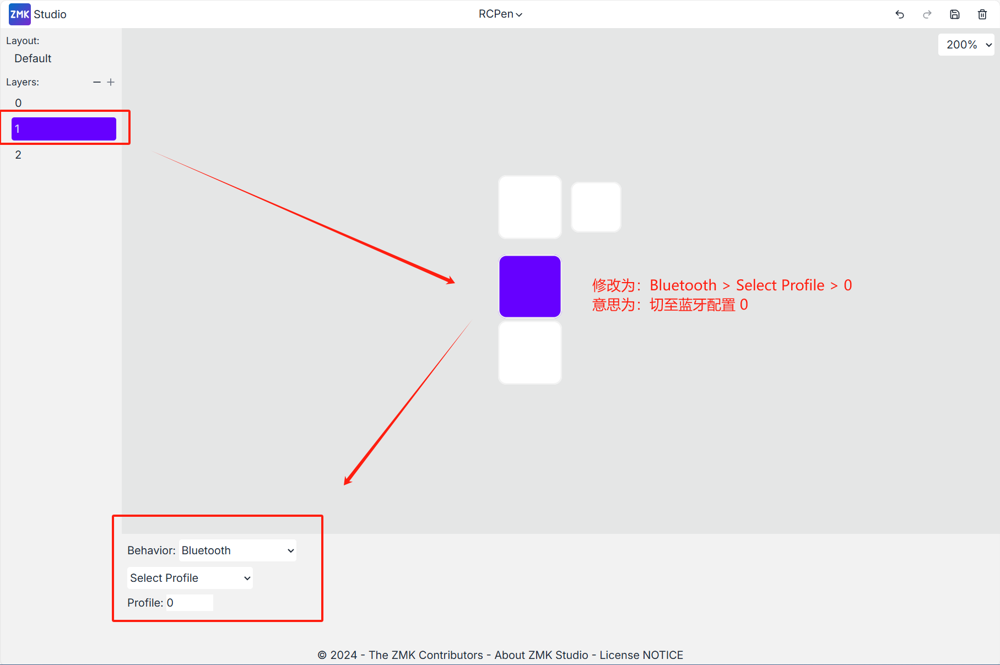 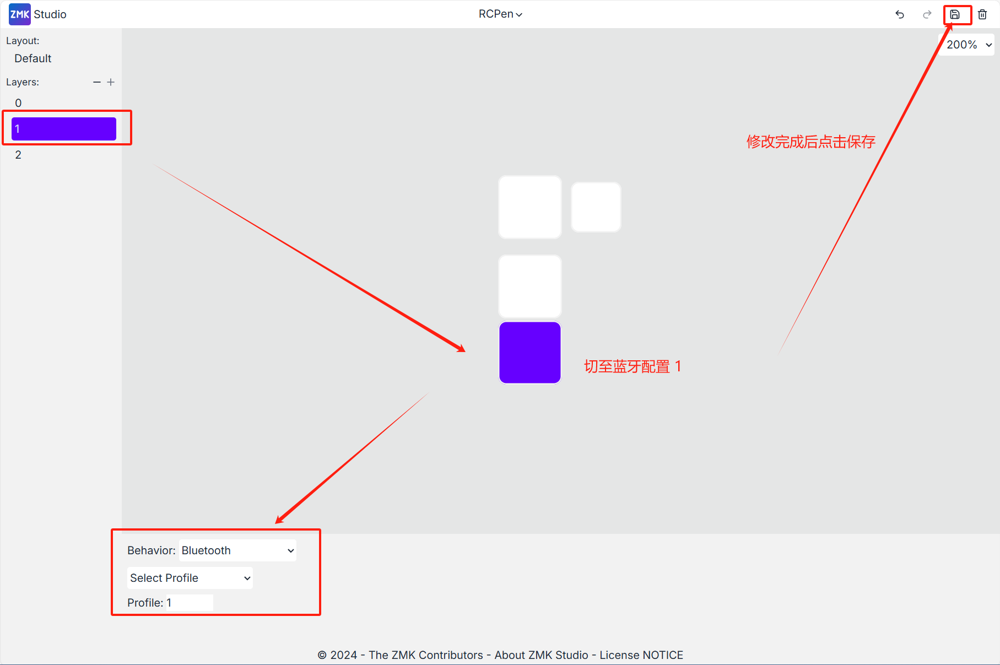

### 附录

键码文档：[https://zmk.dev/docs/keymaps/list-of-keycodes](https://zmk.dev/docs/keymaps/list-of-keycodes)

## ❗异常说明

| **异常** | 说明 | **解决方案** |
| --- | --- | --- |
| 设备显示无法配对 | 当前蓝牙配置已被占用，且不是要连接的设备 | **方案一**：切换其他未配对的蓝牙配置位 **方案二**：按下底部按钮->清空所有蓝牙配置 |
| 改键网页未显示设备或出现failed | 未发现设备串口 | **方案一**：刷新网页 **方案二**：重新插拔设备 若上述方案依然未发现设备，需要检查数据线是否存在问题(请勿使用苹果typec数据线)  |
| 特殊按钮失效不可用 | 出现 返回键、旋钮音量键 在阅读器系统失效的问题 原因：阅读器系统非完整安卓系统，存在对蓝牙键值识别异常的问题。  | **方案一：找店主更换旋钮键值为安卓音量键的固件。**   **返回键依然会失效，可以更换为阅读器系统支持的快捷键** |
